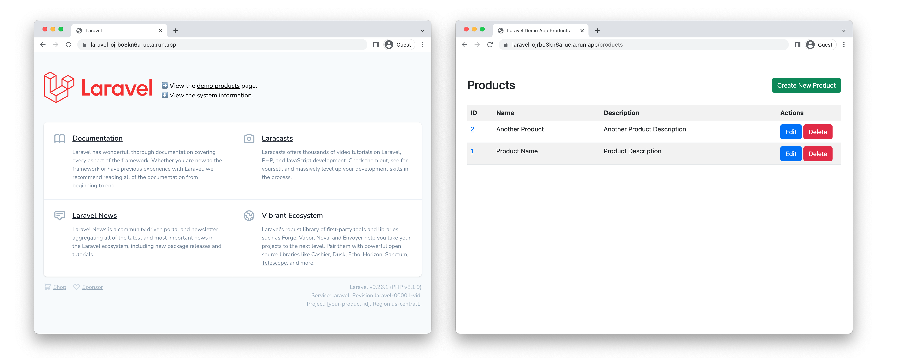

# Laravel on Cloud Run

This sample shows you how to deploy Laravel on Cloud Run, connecting to a Cloud SQL database, and using Secret Manager for credential management.

The deployed example will be a simple CRUD application listing products, and a customised Laravel welcome page showing the deployment information. 




## Objectives

In this tutorial, you will:

* Create and connect a Cloud SQL database.
* Create and use Secret Manager secret values.
* Deploy a Laravel app to Cloud Run.
* Host static files on Cloud Storage.
* Use Cloud Build to automate deployment.
* Use Cloud Run Jobs to apply database migrations. 

## Costs

This tutorial uses the following billable components of Google Cloud:

* Cloud SQL
* Cloud Storage
* Cloud Run
* Cloud Build
* Artifact Registry
* Secret Manager


## Prerequisites

* Create a [Google Cloud project](https://cloud.google.com/resource-manager/docs/creating-managing-projects)
* Ensure [Billing](https://cloud.google.com/billing/docs/how-to/verify-billing-enabled) is enabled.
* [Install](https://cloud.google.com/sdk/docs/install) and [initialize](https://cloud.google.com/sdk/docs/initializing) the Google Cloud CLI
   * You can run the gcloud CLI in the Google Cloud console without installing the Google Cloud CLI. To run the gcloud CLI in the Google Cloud console, use [Cloud Shell](https://console.cloud.google.com/home/dashboard?cloudshell=true).
* [Enable the required APIs](https://console.cloud.google.com/flows/enableapi?apiid=run.googleapis.com,sql-component.googleapis.com,sqladmin.googleapis.com,compute.googleapis.com,cloudbuild.googleapis.com,secretmanager.googleapis.com,artifactregistry.googleapis.com)
    ```bash
    gcloud services enable \
        run.googleapis.com \
        sql-component.googleapis.com \
        sqladmin.googleapis.com \
        compute.googleapis.com \
        cloudbuild.googleapis.com \
        secretmanager.googleapis.com \
        artifactregistry.googleapis.com
    ```
* Ensure sufficient permissions are available to the account used for this tutorial
   * Note: In cases where the [Owner](https://cloud.google.com/iam/docs/understanding-roles#basic) permissions role cannot be used, the following minimum roles are required to complete the tutorial: Cloud SQL Admin, Storage Admin, Cloud Run Admin, and Secret Manager Admin.

## Prepare your environment

* Clone a copy of the code into your local machine; 

    ```bash
    git clone https://github.com/GoogleCloudPlatform/php-docs-samples.git
    cd php-docs-samples/run/laravel/
    ```

## Confirm your PHP setup

You will need PHP on your local system in order to generate run `php artisan` commands later.

* Check you have PHP 8.0.2 or higher installed (or [install it](https://www.php.net/manual/en/install.php)):

    ```bash
    php --version
    ```

* Check you have `composer` installed (or [install it](https://getcomposer.org/download/)): 

    ```bash
    composer --version
    ```

* Install the PHP dependencies: 

    ```bash
    composer install
    ```

## Confirm your Node setup

You will need Node on your local system in order to generate static assets later. 

* Check you have node and npm installed (or [install them](https://cloud.google.com/nodejs/docs/setup)):

    ```bash
    node --version
    npm --version
    ```


* Install the Node dependencies: 

    ```bash
    npm install
    ```


## Preparing backing services

There are many variables in this tutorial. Set these early to help with copying code snippets: 

```
export PROJECT_ID=$(gcloud config get-value project)
export PROJECTNUM=$(gcloud projects describe ${PROJECT_ID} --format='value(projectNumber)')
export REGION=us-central1
export INSTANCE_NAME=myinstance
export DATABASE_NAME=mydatabase
export DATABASE_USERNAME=myuser
export DATABASE_PASSWORD=$(cat /dev/urandom | LC_ALL=C tr -dc '[:alpha:]'| fold -w 30 | head -n1) 
export ASSET_BUCKET=${PROJECT_ID}-static
```

### Cloud SQL

* Create a MySQL instance: 

    ```bash
    gcloud sql instances create ${INSTANCE_NAME} \
        --project ${PROJECT_ID} \
        --database-version MYSQL_8_0 \
        --tier db-f1-micro \
        --region ${REGION}
    ```

    Note: if this operation takes longer than 10 minutes to complete, run the suggested `gcloud beta sql operations wait` command to track ongoing progress.

* Create a database in that MySQL instance: 

    ```bash
    gcloud sql databases create ${DATABASE_NAME} \
        --instance ${INSTANCE_NAME}
    ```

* Create a user for the database: 

    ```bash
    gcloud sql users create ${DATABASE_USERNAME} \
        --instance ${INSTANCE_NAME} \
        --password ${DATABASE_PASSWORD}
    ```

### Setup Cloud Storage


* Create a Cloud Storage bucket: 

    ```bash
    gsutil mb gs://${ASSET_BUCKET}
    ```

### Setup Artifact Registry

* Create an Artifact Registry: 

    ```bash
    gcloud artifacts repositories create containers \
        --repository-format=docker \
        --location=${REGION}
    ```

* Determine the registry name for future operations: 

    ```bash
    export REGISTRY_NAME=${REGION}-docker.pkg.dev/${PROJECT_ID}/containers
    ```

### Configuring the Laravel Application


* Copy the `.env.example` file into `.env`
    ```bash
    cp .env.example .env
    ```

* Update the values in `.env` with your values. 
    
    ⚠️ Replace `${}` with your values, don't use the literals. Get these values with e.g. `echo ${DATABASE_NAME}`

    * DB_CONNECTION: `mysql`
    * DB_SOCKET:  `/cloudsql/${PROJECT_ID}:${REGION}:${INSTANCE_NAME}`
    * DB_DATABASE: `${DATABASE_NAME}`
    * DB_USERNAME: `${DATABASE_USERNAME}`
    * DB_PASSWORD: `${DATABASE_PASSWORD}`
    * ASSET_BUCKET: `${ASSET_BUCKET}`

    Note: `ASSET_URL` is generated from `ASSET_BUCKET` and doesn't need to be hardcoded.

* Update the `APP_KEY` by generating a new key: 
    ```bash
    php artisan key:generate
    ```
* Confirm the `APP_KEY` value in `.env` has been updated.


### Store secret values in Secret Manager

* Create a secret with the value of your `.env` file: 

    ```bash
    gcloud secrets create laravel_settings --data-file .env
    ```

### Configure access to the secret

* Allow Cloud Run access to the secret: 

    ```bash
    gcloud secrets add-iam-policy-binding laravel_settings \
        --member serviceAccount:${PROJECTNUM}-compute@developer.gserviceaccount.com \
        --role roles/secretmanager.secretAccessor
    ```

## Build, Migrate, and Deploy

### Build the app into a container

* Using Cloud Build and Google Cloud Buildpacks, create the container image: 

    ```bash
    gcloud builds submit \
        --pack image=${REGISTRY_NAME}/laravel
    ```

### Applying database migrations

With Cloud Run Jobs, you can use the same container from your service to perform administration tasks, such as database migrations. 

The configuration is similar to the deployment to Cloud Run, requiring the database and secret values. 

1. Create a Cloud Run job to apply database migrations:

    ```
    gcloud beta run jobs create migrate \
        --image=${REGISTRY_NAME}/laravel \
        --region=${REGION} \
        --set-cloudsql-instances ${PROJECT_ID}:${REGION}:${INSTANCE_NAME} \
        --set-secrets /config/.env=laravel_settings:latest \
        --command launcher \
        --args "php artisan migrate"
    ```

1. Execute the job:

    ```
    gcloud beta run jobs execute migrate --region ${REGION} --wait
    ```

* Confirm the application of database migrations by clicking the "See logs for this execution" link. 

  * You should see "INFO Running migrations." with multiple items labelled "DONE". 
  * You should also see "Container called exit(0).", where `0` is the exit code for success.

### Upload static assets

Using the custom `npm` command, you can use `vite` to compile and `gsutil` to copy the assets from your application to Cloud Storage. 

* Upload static assets: 

    ```bash
    npm run update-static
    ```

    This command uses the `update-static` script in `package.json`. 

* Confirm the output of this operation

   * You should see vite returning "N modules transformed", and gsutil returning "Operation completed over N objects"

### Deploy the service to Cloud Run

1. Deploy the service from the previously created image, specifying the database connection and secret configuration: 

    ```bash
    gcloud run deploy laravel \
        --image ${REGISTRY_NAME}/laravel \
        --region $REGION \
        --set-cloudsql-instances ${PROJECT_ID}:${REGION}:${INSTANCE_NAME} \
        --set-secrets /config/.env=laravel_settings:latest \
        --allow-unauthenticated
    ```

### Confirm deployment success

1. Go to the Service URL to view the website.

1. Confirm the information in the lower right of the Laravel welcome screen. 

   * You should see a variation of "Laravel v9... (PHP v8...)" (the exact version of Laravel and PHP may change)
   * You should see the a variation of "Service: laravel. Revision laravel-00001-vid." (the revision name ends in three random characters, which will differ for every deployment)
   * You should see "Project: (your project). Region (your region)." 

1. Click on the "demo products" link, and create some entries. 

   * You should be able to see a styled page, confirming static assets are being served. 
You should be able to write entries to the database, and read them back again, confirming database connectivity. 

## Updating the application

While the initial provisioning and deployment steps were complex, making updates is a simpler process. 

To make changes: build the container (to capture any new application changes), then update the service to use this new container image:

    ```bash
    gcloud builds submit \
        --pack image=${REGISTRY_NAME}/laravel
    ```

To apply application code changes, update the Cloud Run service with this new container:

    ```bash
    gcloud run services update laravel \
        --image ${REGISTRY_NAME}/laravel \
        --region ${REGION}
    ```

    Note: you do not have to re-assert the database or secret settings on future deployments, unless you want to change these values. 

To apply database migrations, run the Cloud Run job using the newly built container:

    ```bash
    gcloud beta run jobs execute migrate --region ${REGION}
    ```

    Note: To generate new migrations to apply, you will need to run `php artisan make:migration` in a local development environment.

To update static assets, run the custom npm command from earlier: 

    ```bash
    npm run update-static
    ```


## Understanding the Code

### Database migrations

This tutorial opts to use Cloud Run Jobs to process database applications in an environment where connections to Cloud SQL can be done in a safe and secure manner. 

This operation could be done on the user's local machine, which would require the installation and use of [Cloud SQL Auth Proxy](https://cloud.google.com/sql/docs/mysql/sql-proxy). Using Cloud Run Jobs removes that complexity. 

### Static compilation

This tutorial opts to use the user's local machine for compiling and uploading static assets. While this could be done in Cloud Run Jobs, this would require building a container with both PHP and NodeJS runtimes. Because NodeJS isn't required for running the service, this isn't required to be in the container. 

### Secrets access 

`bootstrap/app.php` includes code to load the mounted secrets, if the folder has been mounted. This relates to the `--set-secrets` command used earlier.  (Look for the `cloudrun_laravel_secret_manager_mount` tag.)

### Environment information

`routes/web.php` includes code to retrieve the service and revision information from Cloud Run environment variable, and from the\ Cloud Run metadata service (Look for the `cloudrun_laravel_get_metadata` tag.)

## Learn more

* [Getting started with PHP on Google Cloud](https://cloud.google.com/php/getting-started)
